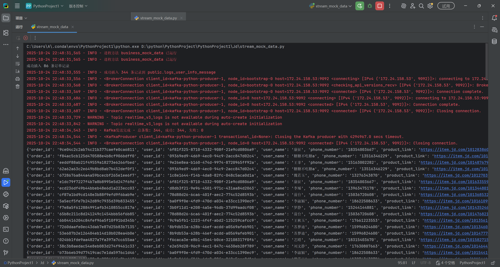
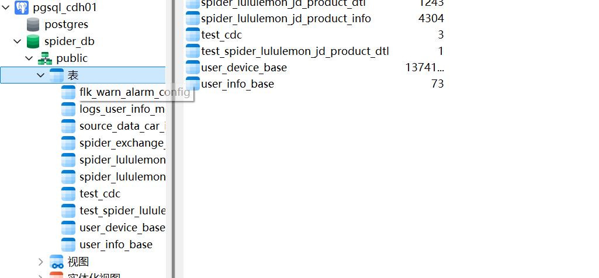
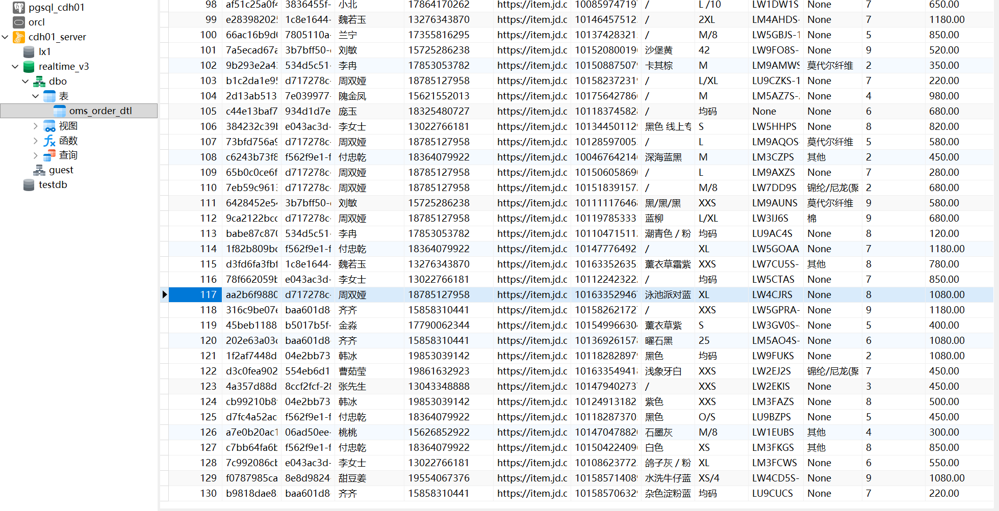

###251024 张艺豪

实时数据导入成功

# !/usr/bin/python
# coding: utf-8
import json
import math
import random
import threading
import uuid
import logging
from multiprocessing import Pool
import requests
import ujson
import time as tm
from kafka import KafkaProducer
from kafka.errors import KafkaTimeoutError, KafkaError
from pip._internal.cli.cmdoptions import retries
from tqdm import tqdm
from minio import Minio, S3Error
from datetime import timedelta, datetime, time

import pandas as pd
import pymssql
import psycopg2
from psycopg2.extras import RealDictCursor, execute_values
from typing import Optional, List, Dict, Any

pd.set_option('display.max_columns', None)
pd.set_option('display.width', 1000)
pd.set_option('display.max_colwidth', 200)

logging.basicConfig(
level=logging.INFO,
format='%(asctime)s - %(levelname)s - %(message)s',
handlers=[
logging.FileHandler('spider_amap_weather.log'),
logging.StreamHandler()
]
)
logger = logging.getLogger(__name__)

# 参数
log_web_page = ['login', 'home', 'product_list', 'product_detail', 'search', 'payment']
search_list = ['运动套装', '瑜伽服', '背心', '斜挎包', '休闲衫', '运动头带', '发圈', '瑜伽裤', '运动内衣', '冬装', '羽绒']
user_device_change_rate = 0.1

# postgres conf
postgresql_ip = '192.168.200.30'
postgresql_port = 5432
postgresql_user_name = 'postgres'
postgresql_user_pwd = 'pgsql'
postgresql_db = 'spider_db'
postgresql_db_schema = 'public'

# sqlserver conf
sqlserver_ip = '192.168.200.30'
sqlserver_port = "1433"
sqlserver_user_name = 'sa'
sqlserver_user_pwd = 'zhangyihao@123'
sqlserver_db = 'realtime_v3'
sqlserver_db_schema = 'dbo'
sqlserver_db_jdbc_url = 'jdbc:sqlserver://this is you ip:1433'

# minio conf
minio_endpoint = ""
minio_secure = False
minio_access_key = ''
minio_secret_key = ''
bucket_name = ""
folder_prefix = ""

# mysql conf
mysql_ip = '192.168.200.32'
mysql_port = "3306"
mysql_user_name = 'root'
mysql_user_pwd = 'root'
mysql_db = 'realtime_v3'

# kafka
kafka_log_topic = 'realtime_v3_logs'
kafka_bootstrap_servers = '172.24.158.53:9092'
kafka_batch_size = 100

minio_client = Minio(
endpoint=minio_endpoint,
access_key=minio_access_key,
secret_key=minio_secret_key,
secure=minio_secure
)

def process_thread_func(v_func_dict_list, v_type, v_process_cnt=1, v_thread_max=21):
"""
批量线程执行方法
:param v_func_dict_list:
:param v_thread_max:
:param v_func_list_dict 传入方法list、参数集合 exp:[{'func_name':'arg1_name,arg2_name'},{'func_name1':'arg1_name,arg2_name'}]
:param v_type 线程 thread 进程 process
:param v_process_cnt 进程数 v_thread_max 线程数
"""
thread_list = []
# 设置最大线程数
thread_max = v_thread_max
if v_func_dict_list and v_type == 'thread':
for i in v_func_dict_list:
func_name = i['func_name']
func_args = i['func_args']
t = threading.Thread(target=func_name, name=i, args=(func_args))
t.start()
thread_list.append(t)
logger.info('线程方法 {} 已运行'.format(func_name.__name__))
if threading.active_count() == thread_max:
for j in thread_list:
j.join()
thread_list = []
for j in thread_list:
j.join()
logger.info('所有线程方法执行结束')

    elif v_func_dict_list and v_type == 'process':
        pool = Pool(processes=v_process_cnt)
        for i in v_func_dict_list:
            try:
                func_name = i['func_name']
                func_args = i['func_args']
                pool.apply_async(func=func_name, args=func_args)
                logger.info('进程方法 {} 已运行'.format(func_name.__name__))
            except Exception as e:
                logger.info('进程报错:', e)
        pool.close()
        pool.join()
        logger.info('所有进程方法执行结束')

def write_orders_to_sqlserver(order_list):
"""批量写入订单数据到SQL Server数据库"""
conn = None
try:
# 建立数据库连接
conn = pymssql.connect(
server=sqlserver_ip,
port=sqlserver_port,
user=sqlserver_user_name,
password=sqlserver_user_pwd,
database=sqlserver_db
)

        with conn.cursor() as cursor:
            # 创建插入SQL（使用参数化查询防止SQL注入）
            # noinspection SqlResolve
            insert_sql = """
            INSERT INTO oms_order_dtl (
                order_id, user_id, user_name, phone_number, product_link, 
                product_id, color, size, item_id, material, sale_num, 
                sale_amount, total_amount, product_name, is_online_sales, 
                shipping_address, recommendations_product_ids, ds, ts
            ) VALUES (
                %s, %s, %s, %s, %s, 
                %s, %s, %s, %s, %s, %s, 
                %s, %s, %s, %s, %s, 
                %s, %s, %s
            )
            """

            # 准备批量数据（所有字段转换为字符串）
            data = []
            for order in order_list:
                # 处理recommendations_product_ids字段
                rec_ids = order["recommendations_product_ids"]
                if isinstance(rec_ids, list):
                    rec_ids = ','.join(rec_ids)

                # 处理布尔值字段
                is_online = "1" if order["is_online_sales"] else "0"

                row = (
                    str(order["order_id"]),
                    str(order["user_id"]),
                    str(order["user_name"]),
                    str(order["phone_number"]),
                    str(order["product_link"])[:255],  # 截断超长字符串
                    str(order["product_id"]),
                    str(order["color"]),
                    str(order["size"]),
                    str(order["item_id"]),
                    str(order["material"]),
                    str(order["sale_num"]),
                    str(order["sale_amount"]),
                    str(order["total_amount"]),
                    str(order["product_name"])[:255],
                    is_online,
                    str(order["shipping_address"])[:255],
                    str(rec_ids)[:1000],
                    str(order["ds"]),
                    str(int(order["ts"]))
                )
                data.append(row)

            # 执行批量插入
            cursor.executemany(insert_sql, data)
            conn.commit()

            print(f"成功插入 {len(order_list)} 条订单记录")

    except Exception as ee:
        print(f"写入数据库时发生错误: {ee}")
        if conn:
            conn.rollback()
    finally:
        if conn:
            conn.close()

def generate_random_list(original_list, min_length=1, max_length=None):
if max_length is None:
max_length = len(original_list)
length = random.randint(min_length, max(max_length, min_length))
return random.sample(original_list, k=length)

def get_postgres_data(
host: str = postgresql_ip,
port: int = postgresql_port,
dbname: str = postgresql_db,
user: str = postgresql_user_name,
password: str = postgresql_user_pwd,
query: Optional[str] = None,
return_df: bool = True
) -> pd.DataFrame | List[Dict[str, Any]]:
conn = psycopg2.connect(
host=host,
port=port,
dbname=dbname,
user=user,
password=password
)

    try:
        with conn.cursor(cursor_factory=RealDictCursor) as cursor:
            cursor.execute(query)
            results = cursor.fetchall()

            if return_df:
                return pd.DataFrame(results)
            else:
                return results

    except Exception as ae:
        print(f"查询数据库时发生错误: {ae}")
        raise
    finally:
        if conn is not None:
            conn.close()

def generate_uuid_order_id():
return uuid.uuid4().hex

def collect_minio_user_device_2postgresql():
all_records = []  # 存储所有解析后的记录
total_bytes_processed = 0  # 已处理的字节数
total_file_size = 0  # 所有文件的总大小

    try:
        if not minio_client.bucket_exists(bucket_name=bucket_name):
            logger.error(f"bucket {bucket_name} don't exists ! ")
            return

        # 计算所有文件的总大小，用于进度计算
        objects = list(minio_client.list_objects(bucket_name, recursive=True))
        for obj in objects:
            total_file_size += obj.size

        # 处理每个文件
        with tqdm(total=total_file_size, desc="读取数据", unit="B", unit_scale=True) as pbar:
            for obj in objects:
                file_name = obj.object_name
                file_size = obj.size
                logger.info(f"scan file: {file_name}, size: {file_size / (1024 * 1024):.2f} MB")

                response = minio_client.get_object(bucket_name, file_name)
                temp_buffer = ""

                # 逐块读取文件内容
                for chunk in response.stream(8192):
                    chunk_size = len(chunk)
                    total_bytes_processed += chunk_size
                    pbar.update(chunk_size)

                    temp_buffer += chunk.decode('utf-8', errors='ignore')

                    # 按行处理数据
                    while '\n' in temp_buffer:
                        line, temp_buffer = temp_buffer.split('\n', 1)
                        try:
                            res_json = ujson.loads(line.strip())
                            res = {
                                "brand": res_json['brand'],
                                "plat": res_json['plat'],
                                "platv": res_json['platv'],
                                "softv": res_json['softv'],
                                "uname": res_json['uname'],
                                "userkey": res_json['userkey'],
                                "datatype": res_json['datatype'],
                                "device": res_json['device'],
                                "ip": res_json['ip'],
                                "net": res_json['net'],
                                "opa": res_json['opa']
                            }
                            all_records.append(res)
                        except Exception as e:
                            logger.warning(f"解析行数据失败: {e}, 行内容: {line[:100]}...")

                response.close()
                response.release_conn()

                logger.info(f"文件处理完成: {file_name}")

        total_records = len(all_records)
        logger.info(f"共解析 {total_records} 条记录")

        if total_records == 0:
            logger.info("没有数据需要写入数据库")
            return

        # batch insert pg
        batch_size = 1000  # 每批插入的记录数
        total_batches = (total_records + batch_size - 1) // batch_size
        inserted_count = 0

        start_time = tm.time()

        with psycopg2.connect(
                host=postgresql_ip,
                port=postgresql_port,
                dbname=postgresql_db,
                user=postgresql_user_name,
                password=postgresql_user_pwd
        ) as conn:
            with conn.cursor() as cursor:

                # 使用tqdm显示插入进度
                with tqdm(total=total_batches, desc="写入数据库", unit="批") as pbar:
                    for i in range(0, total_records, batch_size):
                        batch = all_records[i:i + batch_size]

                        # 准备批量插入的数据
                        values = [(
                            r['brand'],
                            r['plat'],
                            r['platv'],
                            r['softv'],
                            r['uname'],
                            r['userkey'],
                            r['datatype'],
                            r['device'],
                            r['ip'],
                            r['net'],
                            r['opa']
                        ) for r in batch]

                        # 批量插入
                        # noinspection SqlResolve
                        insert_sql = """
                        INSERT INTO spider_db.public.user_device_base (
                            brand, plat, platv, softv, uname, userkey, datatype, device, ip, net, opa
                        ) VALUES %s
                        """

                        # 使用psycopg2的execute_values进行批量插入
                        from psycopg2.extras import execute_values
                        execute_values(cursor, insert_sql, values)

                        inserted_count += len(batch)

                        # 更新进度条
                        pbar.update(1)

                        # 每1%更新一次进度条显示
                        progress_percentage = (inserted_count / total_records) * 100
                        if progress_percentage % 1 <= (len(batch) / total_records) * 100:
                            pbar.set_postfix({"进度": f"{progress_percentage:.1f}%"})

                conn.commit()

        end_time = tm.time()
        duration = end_time - start_time

        # 输出汇总结果
        logger.info("===== 汇总结果 =====")
        logger.info(f"总耗时: {duration:.2f} 秒")
        logger.info(f"总处理文件数: {len(objects)}")
        logger.info(f"总插入记录数: {inserted_count}")
        logger.info(f"平均插入速度: {inserted_count / duration:.2f} 条/秒")
        logger.info("===================")

        push_msg = {
            "platform": 'Data Spy',
            "context": 'collect_minio_user_device_2postgresql',
            "total_time": str(f'{duration:.2f}'),
            "success_count": inserted_count,
            "fail_count": 0,
        }

        push_feishu_msg(push_msg)
        logger.info("push Message To Lark Suc ...")

    except S3Error as e:
        logger.error(f"MinIO错误: {e}")
    except Exception as e:
        logger.error(f"发生未知错误: {e}")

def push_feishu_msg(msg) -> None:
"""
推送消息到飞书
"""

    feishu_url = ''
    try:
        # 发送POST请求
        response = requests.post(
            url=feishu_url,
            headers={"Content-Type": "application/json"},
            data=json.dumps(msg),
            timeout=10
        )

        print(f"Response status code: {response.status_code}")
        if response.text:
            print(f"Response content: {response.text}")

    except Exception as e:
        print(f"Error sending message: {str(e)}")
        import traceback
        traceback.print_exc()

def generate_random_in_range(low, high, data_type='float', precision=None):
"""
生成指定区间的随机数

    参数:
    low (int/float): 区间下限
    high (int/float): 区间上限
    data_type (str): 数据类型，'int' 或 'float' (默认)
    precision (int): 浮点数精度（小数位数），仅当 data_type='float' 时有效

    返回:
    int/float: 指定区间内的随机数
    """
    # 验证输入
    # 自动交换上下限
    if low > high:
        low, high = high, low

    if not isinstance(low, (int, float)) or not isinstance(high, (int, float)):
        raise ValueError("low 和 high 必须是数字类型 (int 或 float)")

    # 根据数据类型生成随机数
    if data_type == 'int':
        # 整数类型
        return random.randint(math.ceil(low), math.floor(high))
    elif data_type == 'float':
        result = random.uniform(low, high)
        # 处理精度
        if precision is not None and precision >= 0:
            result = round(result, precision)

        return result
    else:
        raise ValueError("data_type 必须是 'int' 或 'float'")

def generate_ordered_timestamps(base_date_str: str, n: int) -> List[datetime]:
"""
生成时间戳序列，满足：
1. 如果是今天的日期，时间戳不超过当前时间
2. 如果不是今天的日期，时间戳在传入日期的当天
3. 时间戳整体递增（允许10%的概率出现比前一条小的时间戳）
4. 有5%的概率使用非当日时间戳（前3天内随机日期）
"""
# 解析基准日期
base_date = datetime.strptime(base_date_str, "%Y%m%d").date()
current_date = datetime.now().date()

    # 计算时间范围
    if base_date == current_date:
        # 今天：时间戳不超过当前时间
        start_of_day = datetime.combine(base_date, time.min)
        end_of_day = datetime.now()
    else:
        # 非今天：使用全天时间范围
        start_of_day = datetime.combine(base_date, time.min)
        end_of_day = datetime.combine(base_date, time.max)

    # 前3天的时间范围
    three_days_earliest = base_date - timedelta(days=3)
    start_of_three_days = datetime.combine(three_days_earliest, time.min)

    # 生成基础递增序列
    total_seconds = (end_of_day - start_of_day).total_seconds()
    if n == 0:
        return []
    elif n == 1:
        random_points = [0.0]
    else:
        random_points = [0.0] + sorted([random.random() for _ in range(n - 1)])

    ts_ms = [start_of_day + timedelta(seconds=x * total_seconds) for x in random_points]

    # 创建乱序和非当日标记
    non_today_flags = [False] * n
    disorder_indices = []

    # 选择10%的乱序位置（跳过第一条）
    if n > 1:
        disorder_count = min(n - 1, max(1, int(0.1 * n)))
        disorder_indices = random.sample(range(1, n), disorder_count)
        # 按索引顺序处理
        disorder_indices.sort()

    # 处理乱序位置
    for idx in disorder_indices:
        prev_timestamp = ts_ms[idx - 1]
        prev_is_non_today = non_today_flags[idx - 1]

        # 5%概率使用非当日时间戳
        use_non_today = random.random() < 0.05

        if use_non_today:
            # 非当日时间戳（前3天内）
            non_today_date = base_date - timedelta(days=random.randint(1, 3))
            non_today_start = datetime.combine(non_today_date, time.min)
            non_today_end = datetime.combine(non_today_date, time.max)

            # 确保不超过前3天的范围
            new_timestamp = datetime.fromtimestamp(
                random.uniform(
                    max(start_of_three_days, non_today_start).timestamp(),
                    min(non_today_end, datetime.combine(base_date, time.min)).timestamp()
                )
            )
            non_today_flags[idx] = True
        else:
            # 当日时间戳（确保比前一条小）
            max_timestamp = prev_timestamp if prev_is_non_today else prev_timestamp
            min_timestamp = start_of_day if not prev_is_non_today else start_of_three_days

            # 生成比前一条小的时间戳
            new_timestamp = datetime.fromtimestamp(
                random.uniform(
                    min_timestamp.timestamp(),
                    max_timestamp.timestamp()
                )
            )

        ts_ms[idx] = new_timestamp

    return ts_ms

def sample_random_items(lst: list, min_count: int = 100, max_count: int = 229) -> list:
if min_count > max_count:
min_count, max_count = max_count, min_count

    actual_max = min(max_count, len(lst))

    if len(lst) < min_count:
        return lst

    sample_size = random.randint(min_count, actual_max)
    return random.sample(lst, sample_size)

def sink_dict_2postgresql(sink_data=None, table_schema='public', table_name='', sink_fields=None):
conn = None
if not sink_data:
raise ValueError("sink_data 不能为空")
if not table_name:
raise ValueError("table_name 不能为空")

    pg_origin_query_sql = f"""
        select
            column_name,
            data_type,
            character_maximum_length,
            is_nullable,
            column_default
        from information_schema.columns
        where table_schema = '{table_schema}' and table_name = '{table_name}';
    """
    origin_message_data = get_postgres_data(query=pg_origin_query_sql, return_df=False)
    table_columns = [i['column_name'] for i in origin_message_data]
    if not sink_fields:
        sink_fields = list(sink_data[0].keys())
    invalid_fields = [f for f in sink_fields if f not in table_columns]
    if invalid_fields:
        raise ValueError(f"字段 {invalid_fields} 不存在于表 {table_schema}.{table_name} 中")
    insert_values = []
    for item in sink_data:
        row = []
        for field in sink_fields:
            # 处理JSON类型字段
            if field == 'log' and isinstance(item.get(field), dict):
                row.append(json.dumps(item[field]))
            else:
                row.append(item.get(field))
        insert_values.append(tuple(row))
    columns_str = ', '.join(sink_fields)
    placeholders = ', '.join(['%s'] * len(sink_fields))
    insert_sql = f"""
        INSERT INTO {table_schema}.{table_name} ({columns_str})
        VALUES %s
    """
    try:
        conn = psycopg2.connect(
            host=postgresql_ip,
            port=postgresql_port,
            dbname=postgresql_db,
            user=postgresql_user_name,
            password=postgresql_user_pwd
        )

        with conn.cursor() as cursor:
            # 使用execute_values进行批量插入
            execute_values(cursor, insert_sql, insert_values)
            conn.commit()

        logger.info(f"成功插入 {len(sink_data)} 条记录到 {table_schema}.{table_name}")
    except Exception as e:
        logger.info(f"插入失败: {e}")
        raise
    finally:
        if conn:
            conn.close()

def sink_dict_data_2kafka(sink_topic='', sink_data=None):

    if not sink_topic:
        raise ValueError("必须指定目标Kafka主题（sink_topic）")
    if not sink_data or len(sink_data) == 0:
        logger.info("待发送数据为空，无需执行发送")
        return

    try:
        producer = KafkaProducer(
            bootstrap_servers=kafka_bootstrap_servers,
            value_serializer=lambda v: json.dumps(v, ensure_ascii=False).encode('utf-8'),
            retries=retries,  # 失败重试
            batch_size=kafka_batch_size,  # 批量大小
            linger_ms=3,  # 延迟发送（聚合批量）
            acks='all',
            max_block_ms=60000  # 发送阻塞超时时间
        )
    except Exception as e:
        logger.error(f"Kafka生产者初始化失败: {str(e)}")
        raise

    try:
        success_count = 0
        fail_count = 0
        # 逐条发送（或批量异步发送）
        for idx, data in enumerate(sink_data):
            try:
                # 异步发送并获取Future对象
                future = producer.send(
                    topic=sink_topic,
                    value=data  # 自动序列化为JSON
                )
                # 同步等待发送结果（如需异步可去掉get()）
                record_metadata = future.get(timeout=10)
                success_count += 1
                # logger.info(
                #     f"数据发送成功 - 主题: {record_metadata.topic}, "
                #     f"分区: {record_metadata.partition}, "
                #     f"偏移量: {record_metadata.offset}"
                # )
            except KafkaTimeoutError:
                fail_count += 1
                logger.warning(f"数据发送超时（索引: {idx}）: {data}")
            except KafkaError as e:
                fail_count += 1
                logger.error(f"Kafka发送失败（索引: {idx}）: {str(e)}, 数据: {data}")
            except Exception as e:
                fail_count += 1
                logger.error(f"未知错误（索引: {idx}）: {str(e)}, 数据: {data}")

        # 确保所有数据被发送
        producer.flush()
        logger.info(
            f"Kafka发送完成 - 总条数: {len(sink_data)}, "
            f"成功: {success_count}, 失败: {fail_count}"
        )

    finally:
        # 关闭生产者
        producer.close()
    pass

def business_mock_data(ds, data_model='batch'):
# 只传入一个日期参数，格式如20250708
# params_ds = "20250708"

    order_list = []
    all_logs_list = []

    # noinspection SqlResolve
    query_sql = """
        select  id, 
                product_link, 
                sale_amount, 
                product_desc, 
                product_id, 
                item_id, 
                material, 
                is_online_sales, 
                color_list, 
                size_list, 
                comments, 
                recommendations_product_id, 
                ts 
        from spider_db.public.spider_lululemon_jd_product_dtl 
        where product_id is not null 
        order by random() 
        limit (floor(random() * (110-80)) + 80);
    """

    # noinspection SqlResolve
    query_pg_device = """
        select brand, plat, platv, softv, uname, userkey, device, ip, net, opa
        from spider_db.public.user_device_base
        order by random()
        limit (floor(random() * (110-80)) + 500);
    """

    # nosql
    # noinspection SqlResolve
    user_query_sql = """
        select user_id,
               uname,
               phone_num,
               address
        from spider_db.public.user_info_base;
    """

    user_info_data = get_postgres_data(query=user_query_sql, return_df=False)
    selected_users = random.choices(user_info_data, k=min(30, len(user_info_data))) if user_info_data else []

    pg_device_data = get_postgres_data(query=query_pg_device, return_df=False)

    lst = get_postgres_data(query=query_sql, return_df=False)
    lens = len(lst)

    # 生成时间戳序列
    timestamps = generate_ordered_timestamps(str(ds), lens)
    order_list = []

    if data_model == 'batch':
        for i, item in enumerate(lst):

            user = random.choice(selected_users) if selected_users else {
                "user_id": "default_user",
                "uname": "匿名用户",
                "phone_num": "00000000000",
                "address": "未知地址"
            }

            color_list = item['color_list']
            # color
            if color_list is not None and len(color_list) > 0:
                color = random.choices(color_list)[0]
            else:
                color = '/'
            size_list = item['size_list']
            if size_list is not None and len(size_list) > 0:
                size = random.choices(size_list)[0]
            else:
                size = '均码'

            product_link = item['product_link']
            product_id = item['product_id']
            item_id = item['item_id']
            material = item['material']
            sale_amount = item.get("sale_amount")
            product_name = item['product_desc']
            is_online_sales = item['is_online_sales']
            recommendations_product_ids = item['recommendations_product_id']

            # 获取时间戳
            timestamp = timestamps[i]
            ts = int(timestamp.timestamp())  # 秒级时间戳
            ds = timestamp.strftime('%Y-%m-%d %H:%M:%S')  # 日期字符串
            sale_num = generate_random_in_range(1, 9, data_type="int")

            order_info = {
                "order_id": generate_uuid_order_id(),
                "user_id": user["user_id"],
                "user_name": user["uname"],
                "phone_number": user["phone_num"],
                "product_link": product_link,
                "product_id": product_id,
                "color": color,
                "size": size,
                "item_id": item_id,
                "material": material,
                "sale_num": sale_num,
                "sale_amount": sale_amount,
                "total_amount": sale_num * sale_amount,
                "product_name": product_name,
                "is_online_sales": is_online_sales,
                "shipping_address": user["address"],
                "recommendations_product_ids": recommendations_product_ids,
                "ds": ds,
                "ts": ts,
            }
            order_list.append(order_info)
            device_info_main = random.choice(pg_device_data) if pg_device_data else {
                'brand': 'Unknown',
                'plat': 'Unknown',
                'platv': 'Unknown',
                'softv': 'Unknown',
                'uname': 'Unknown',
                'userkey': 'Unknown',
                'device': 'Unknown',
                'ip': '0.0.0.0',
                'net': 'Unknown',
                'opa': 'Unknown'
            }
            use_variation = random.random() < user_device_change_rate
            log_count = random.randint(2, 6)
            required_logs = ['payment']
            other_logs = random.choices(
                [log for log in log_web_page if log != 'payment'],
                k=log_count - 1
            )
            log_types = required_logs + other_logs
            random.shuffle(log_types)
            log_timestamps = sorted(
                [ts - random.randint(1, 3600) for _ in range(log_count)],
                reverse=True
            )
            for j in range(log_count):
                # 如果启用变化模式且满足10%概率，使用新设备
                if use_variation and random.random() < 0.1:
                    device_info = random.choice(pg_device_data) if pg_device_data else device_info_main
                else:
                    device_info = device_info_main

                log_entry = {
                    'log_id': generate_uuid_order_id(),
                    'device': {
                        'brand': device_info['brand'],
                        'plat': device_info['plat'],
                        'platv': device_info['platv'],
                        'softv': device_info['softv'],
                        'uname': device_info['uname'],
                        'userkey': device_info['userkey'],
                        'device': device_info['device']
                    },
                    'gis': {
                        'ip': device_info['ip']
                    },
                    'network': {
                        'net': device_info['net']
                    },
                    'opa': device_info['opa'],
                    'log_type': log_types[j],
                    'ts': log_timestamps[j],  # 日志时间戳
                    'product_id': product_id,  # 关联的商品ID
                    'order_id': order_info['order_id'],  # 关联的订单ID
                    'user_id': order_info['user_id']
                }
                all_logs_list.append(log_entry)
        write_orders_to_sqlserver(order_list)
        # FIXME 该处代码后期调试完成后 该数据写入数据库和kafka中
        for log in all_logs_list:
            if log['log_type'] == 'search':
                log['keywords'] = generate_random_list(search_list)
        transformed_data = []
        sink_fields = ['log_id', 'log']
        for item in all_logs_list:
            log_id = item['log_id']
            data = {
                'log_id': log_id,
                'log': item
            }
            transformed_data.append(data)
        sink_dict_2postgresql(sink_data=transformed_data, table_name='logs_user_info_message', sink_fields=sink_fields)
        sink_dict_data_2kafka(sink_topic=kafka_log_topic, sink_data=all_logs_list)
        # return order_list

    if data_model == 'stream':

        all_logs_list = []

        while True:
            user_info_data = get_postgres_data(query=user_query_sql, return_df=False)
            selected_users = random.choices(user_info_data, k=min(30, len(user_info_data))) if user_info_data else []
            lst = get_postgres_data(query=query_sql, return_df=False)
            res = []
            for i, item in enumerate(lst):
                tm.sleep(2)
                user = random.choice(selected_users) if selected_users else {
                    "user_id": "default_user",
                    "uname": "匿名用户",
                    "phone_num": "00000000000",
                    "address": "未知地址"
                }

                color_list = item['color_list']
                # color
                if color_list is not None and len(color_list) > 0:
                    color = random.choices(color_list)[0]
                else:
                    color = '/'
                size_list = item['size_list']
                if size_list is not None and len(size_list) > 0:
                    size = random.choices(size_list)[0]
                else:
                    size = '均码'

                sale_num = generate_random_in_range(1, 9, data_type="int")

                product_link = item['product_link']
                product_id = item['product_id']
                item_id = item['item_id']
                material = item['material']
                sale_amount = item.get("sale_amount")
                product_name = item['product_desc']
                is_online_sales = item['is_online_sales']
                recommendations_product_ids = item['recommendations_product_id']

                ds_now = datetime.now()

                # 5%的概率生成历史时间戳
                if random.random() < 0.05:
                    # 计算时间范围：前3天到今天
                    start_time = ds_now - timedelta(days=3)

                    # 生成该范围内的随机时间戳（确保不超过当前时间）
                    random_timestamp = random.uniform(
                        start_time.timestamp(),
                        ds_now.timestamp()
                    )
                    ds_now = datetime.fromtimestamp(random_timestamp)
                else:
                    # 95%概率使用当前时间
                    ds_now = ds_now

                order_info = {
                    "order_id": generate_uuid_order_id(),
                    "user_id": user["user_id"],
                    "user_name": user["uname"],
                    "phone_number": user["phone_num"],
                    "product_link": product_link,
                    "product_id": product_id,
                    "color": color,
                    "size": size,
                    "item_id": item_id,
                    "material": material,
                    "sale_num": sale_num,
                    "sale_amount": sale_amount,
                    "total_amount": sale_num * sale_amount,
                    "product_name": product_name,
                    "is_online_sales": is_online_sales,
                    "shipping_address": user["address"],
                    "recommendations_product_ids": recommendations_product_ids,
                    "ds": ds_now.strftime('%Y-%m-%d %H:%M:%S'),
                    "ts": ds_now.timestamp() * 1000,
                }
                res.append(order_info)

                device_info_main = random.choice(pg_device_data) if pg_device_data else {
                    'brand': 'Unknown',
                    'plat': 'Unknown',
                    'platv': 'Unknown',
                    'softv': 'Unknown',
                    'uname': 'Unknown',
                    'userkey': 'Unknown',
                    'device': 'Unknown',
                    'ip': '0.0.0.0',
                    'net': 'Unknown',
                    'opa': 'Unknown'
                }
                use_variation = random.random() < user_device_change_rate
                log_count = random.randint(2, 6)
                required_logs = ['payment']
                other_logs = random.choices(
                    [log for log in log_web_page if log != 'payment'],
                    k=log_count - 1
                )
                log_types = required_logs + other_logs
                random.shuffle(log_types)
                log_timestamps = sorted(
                    [order_info["ts"] - random.randint(1, 3600) for _ in range(log_count)],
                    reverse=True
                )
                for j in range(log_count):
                    if use_variation and random.random() < 0.1:
                        device_info = random.choice(pg_device_data) if pg_device_data else device_info_main
                    else:
                        device_info = device_info_main

                    log_entry = {
                        'log_id': generate_uuid_order_id(),
                        'device': {
                            'brand': device_info['brand'],
                            'plat': device_info['plat'],
                            'platv': device_info['platv'],
                            'softv': device_info['softv'],
                            'uname': device_info['uname'],
                            'userkey': device_info['userkey'],
                            'device': device_info['device']
                        },
                        'gis': {'ip': device_info['ip']},
                        'network': {'net': device_info['net']},
                        'opa': device_info['opa'],
                        'log_type': log_types[j],
                        'ts': log_timestamps[j],
                        'product_id': order_info["product_id"],
                        'order_id': order_info["order_id"],
                        'user_id': order_info["user_id"]
                    }

                    # 如果是搜索日志，添加关键词
                    if log_types[j] == 'search':
                        log_entry['keywords'] = generate_random_list(search_list)

                    all_logs_list.append(log_entry)

                # 每20个订单批量处理一次
                if len(res) >= 20:
                    write_orders_to_sqlserver(res)

                    # 写入日志到PostgreSQL和Kafka
                    if all_logs_list:
                        # 转换日志格式
                        transformed_data = []
                        sink_fields = ['log_id', 'log']
                        for log in all_logs_list:
                            data = {
                                'log_id': log['log_id'],
                                'log': log
                            }
                            transformed_data.append(data)
                        # 写入PostgreSQL
                        sink_dict_2postgresql(sink_data=transformed_data, table_name='logs_user_info_message', sink_fields=sink_fields)
                        # 写入Kafka
                        sink_dict_data_2kafka(sink_topic=kafka_log_topic, sink_data=all_logs_list)
                        # 清空日志列表
                        all_logs_list.clear()
                    # 清空订单列表
                    res.clear()
                print(order_info)

def main(ds_ms):
# collect_minio_user_device_2postgresql()
func_list = [
{'func_name': business_mock_data, 'func_args': (ds_ms, 'batch')},
{'func_name': business_mock_data, 'func_args': (ds_ms, 'stream')}
]
process_thread_func(func_list, v_type='process', v_process_cnt=2)

    # business_mock_data(ds=ds_ms, data_model='batch')

if __name__ == '__main__':
main(ds_ms=20251023)
# print(generate_random_in_range(1, 5, data_type="int"))
# collect_minio_user_device_2postgresql()
# print(generate_uuid_order_id())
pass
