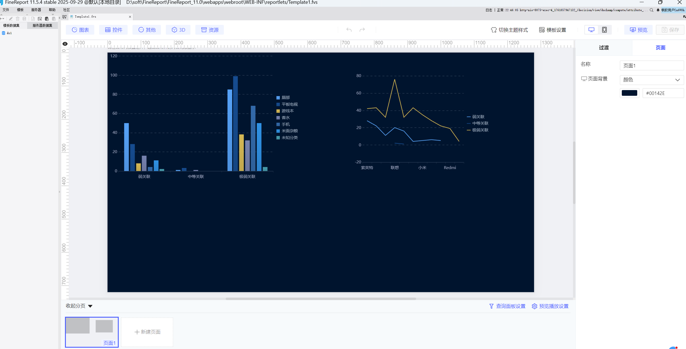

###251020 张艺豪
1工单指标完成，报表联动进行中

报表1
--MaxCompute SQL
--********************************************************************--
--author: wangduoyu123
--create time: 2025-10-20 16:22:10
--********************************************************************--

-- 工单编号：大数据-电商数仓-05-商品主题连带分析看板
-- 功能：最终连带分析看板数据，包含商品名称和完整关联信息
CREATE TABLE IF NOT EXISTS ads_product_tie_in_analysis (
main_sku_id         BIGINT COMMENT '主商品ID',
main_sku_name       STRING COMMENT '主商品名称',
main_category_name  STRING COMMENT '主商品分类',
main_tm_name        STRING COMMENT '主商品品牌',
tie_in_sku_id       BIGINT COMMENT '关联商品ID',
tie_in_sku_name     STRING COMMENT '关联商品名称',
tie_in_category_name STRING COMMENT '关联商品分类',
tie_in_tm_name      STRING COMMENT '关联商品品牌',
visit_together_cnt  BIGINT COMMENT '同时访问次数',
cart_together_cnt   BIGINT COMMENT '同时加购次数',
order_together_cnt  BIGINT COMMENT '同时下单次数',
tie_in_rate         DECIMAL(16,4) COMMENT '连带率',
relation_level      STRING COMMENT '关联等级'
) COMMENT '商品连带分析看板表'
PARTITIONED BY (ds STRING);

-- 修正分层实现的关联等级计算（方案1）
INSERT OVERWRITE TABLE ads_product_tie_in_analysis PARTITION(ds = '20251016')
SELECT
pr.main_sku_id,
COALESCE(main_pd.sku_name, '未知商品') as main_sku_name,
COALESCE(main_pd.category3_name, '未知分类') as main_category_name,
COALESCE(main_pd.tm_name, '未知品牌') as main_tm_name,
pr.tie_in_sku_id,
COALESCE(tie_in_pd.sku_name, '未知商品') as tie_in_sku_name,
COALESCE(tie_in_pd.category3_name, '未知分类') as tie_in_category_name,
COALESCE(tie_in_pd.tm_name, '未知品牌') as tie_in_tm_name,
pr.visit_together as visit_together_cnt,
pr.cart_together as cart_together_cnt,
pr.order_together as order_together_cnt,
pr.relation_score as tie_in_rate,
-- 修正关联等级阈值
CASE
WHEN pr.relation_score >= 0.3 THEN '强关联'      -- 降低阈值
WHEN pr.relation_score >= 0.15 THEN '中等关联'   -- 降低阈值  
WHEN pr.relation_score >= 0.05 THEN '弱关联'     -- 降低阈值
ELSE '极弱关联'
END as relation_level
FROM dws_product_relation pr
LEFT JOIN dwd_product_dim main_pd ON pr.main_sku_id = main_pd.sku_id AND main_pd.ds = '20251016'
LEFT JOIN dwd_product_dim tie_in_pd ON pr.tie_in_sku_id = tie_in_pd.sku_id AND tie_in_pd.ds = '20251016'
WHERE pr.ds = '20251016'
ORDER BY pr.visit_together DESC, pr.relation_score DESC
LIMIT 500;

SELECT * FROM ads_product_tie_in_analysis WHERE ds = '20251016';

报表2
'''PyODPS 3
请确保不要使用从 MaxCompute下载数据来处理。下载数据操作常包括Table/Instance的open_reader以及 DataFrame的to_pandas方法。
推荐使用 MaxFrame DataFrame（从 MaxCompute 表创建）来处理数据，MaxFrame DataFrame数据计算发生在MaxCompute集群，无需拉数据至本地。
MaxFrame相关介绍及使用可参考：https://help.aliyun.com/zh/maxcompute/user-guide/maxframe
'''

# 使用商品表实际的日期
bizdate = '20251016'

print("开始执行新品追踪看板业务逻辑（完整分层实现）...")
print(f"业务日期: {bizdate}")

# 第一步：创建分层表结构（修复数据类型）
print("1. 创建分层表结构...")

table_creation_sqls = [
"""
CREATE TABLE IF NOT EXISTS dwd_new_product_base (
product_id STRING,
product_name STRING,
product_image STRING,
product_no STRING,
first_online_date STRING,
is_tmall_new BIGINT,
is_blackbox_new BIGINT
) PARTITIONED BY (dt STRING) LIFECYCLE 7
""",
"""
CREATE TABLE IF NOT EXISTS dws_new_product_payment (
product_id STRING,
pay_amount_30d DECIMAL(18,2)  -- 明确指定数据类型
) PARTITIONED BY (dt STRING) LIFECYCLE 7
"""
]

for sql in table_creation_sqls:
try:
o.execute_sql(sql)
except Exception as e:
print(f"表创建警告: {e}")

print("表结构准备完成")

# 第二步：分层处理（修复数据类型转换）
print("2. 开始分层数据处理...")

# DWD层
dwd_sql = f"""
INSERT OVERWRITE TABLE dwd_new_product_base PARTITION (dt='{bizdate}')
SELECT
sku_id as product_id,
sku_name as product_name,
'' as product_image,
sku_id as product_no,
ds as first_online_date,
0 AS is_tmall_new,
0 AS is_blackbox_new
FROM dwd_product_dim
WHERE ds = '{bizdate}'
"""

# DWS层 - 添加显式类型转换
dws_sql = f"""
INSERT OVERWRITE TABLE dws_new_product_payment PARTITION (dt='{bizdate}')
SELECT
n.product_id,
CAST(SUM(o.order_amount) AS DECIMAL(18,2)) AS pay_amount_30d  -- 添加CAST
FROM dwd_new_product_base n
JOIN dwd_order_detail o ON n.product_id = o.sku_id
WHERE n.dt = '{bizdate}' AND o.ds = '{bizdate}'
AND o.create_time IS NOT NULL
AND DATEDIFF(TO_DATE(o.create_time, 'yyyy-mm-dd'), TO_DATE(n.first_online_date, 'yyyy-mm-dd')) <= 30
GROUP BY n.product_id
"""

# ADS层
ads_sql = f"""
INSERT OVERWRITE TABLE ads_product_new_item_daily PARTITION (dt='{bizdate}')
SELECT
n.product_id,
n.product_name,
n.product_image,
n.product_no,
n.is_tmall_new,
n.is_blackbox_new,
n.first_online_date,
CAST(COALESCE(p.pay_amount_30d, 0) AS DECIMAL(18,2)) AS pay_amount_30d,
1 as is_in_30d
FROM dwd_new_product_base n
LEFT JOIN dws_new_product_payment p ON n.product_id = p.product_id AND p.dt = '{bizdate}'
WHERE n.dt = '{bizdate}'
"""

# 执行分层处理
layers = [
("DWD层", dwd_sql),
("DWS层", dws_sql),
("ADS层", ads_sql)
]

for layer_name, layer_sql in layers:
print(f"执行{layer_name}...")
try:
o.execute_sql(layer_sql).wait_for_success()
print(f"{layer_name}完成")

        # 检查每层的数据量
        if layer_name == "DWD层":
            check_sql = f"SELECT COUNT(*) as cnt FROM dwd_new_product_base WHERE dt='{bizdate}'"
        elif layer_name == "DWS层":
            check_sql = f"SELECT COUNT(*) as cnt FROM dws_new_product_payment WHERE dt='{bizdate}'"
        else:
            check_sql = f"SELECT COUNT(*) as cnt FROM ads_product_new_item_daily WHERE dt='{bizdate}'"
            
        check_result = o.execute_sql(check_sql)
        with check_result.open_reader() as reader:
            for record in reader:
                print(f"  {layer_name}生成 {record.cnt} 条记录")
                
    except Exception as e:
        print(f" {layer_name}失败: {e}")
        break

# 详细验证结果
print("\n详细验证分层实现结果...")
detail_verify_sql = f"""
SELECT
COUNT(*) as total_count,
SUM(pay_amount_30d) as total_amount,
AVG(pay_amount_30d) as avg_amount
FROM ads_product_new_item_daily
WHERE dt = '{bizdate}'
"""

try:
detail_result = o.execute_sql(detail_verify_sql)
with detail_result.open_reader() as reader:
for record in reader:
print(f"最终结果统计:")
print(f"总记录数: {record.total_count}")
print(f"总支付金额: {record.total_amount}")
print(f"平均支付金额: {record.avg_amount}")

    # 显示前几条记录
    sample_sql = f"""
    SELECT 
        product_id,
        product_name,
        first_online_date,
        pay_amount_30d,
        is_in_30d
    FROM ads_product_new_item_daily 
    WHERE dt = '{bizdate}'
    ORDER BY pay_amount_30d DESC
    LIMIT 5
    """
    
    sample_result = o.execute_sql(sample_sql)
    with sample_result.open_reader() as reader:
        print(f"\n前5条数据预览:")
        for record in reader:
            print(f"  {record.product_id} | {record.product_name} | {record.first_online_date} | {record.pay_amount_30d}")

except Exception as e:
print(f"详细验证失败: {e}")

# 查询ADS层数据 - 返回原始数据，帆软会自己格式化
query_sql = f"""
SELECT
product_id as 商品ID,
product_name as 商品名称,
CASE WHEN is_tmall_new = 1 THEN '是' ELSE '否' END as 是否天猫新品,
CASE WHEN is_blackbox_new = 1 THEN '是' ELSE '否' END as 是否小黑盒新品,
first_online_date as 上架日期,
pay_amount_30d as 30天支付金额,
CASE WHEN is_in_30d = 1 THEN '是' ELSE '否' END as 是否在30天内
FROM ads_product_new_item_daily
WHERE dt = '20251016'
ORDER BY pay_amount_30d DESC
"""

try:
result = o.execute_sql(query_sql)
with result.open_reader() as reader:
print("数据查询成功！可以在帆软中使用以下SQL：")
print(query_sql)
print("\n数据样例：")
record_count = 0
for record in reader:
if record_count < 3:  # 只显示前3条作为样例
print(f"商品ID: {record['商品ID']}, 商品名称: {record['商品名称']}, 支付金额: {record['30天支付金额']}")
record_count += 1
print(f"... 共 {record_count} 条记录")

except Exception as e:
print(f"查询失败: {e}")