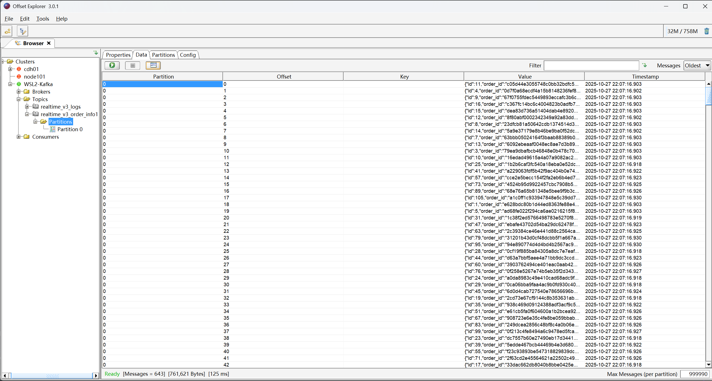
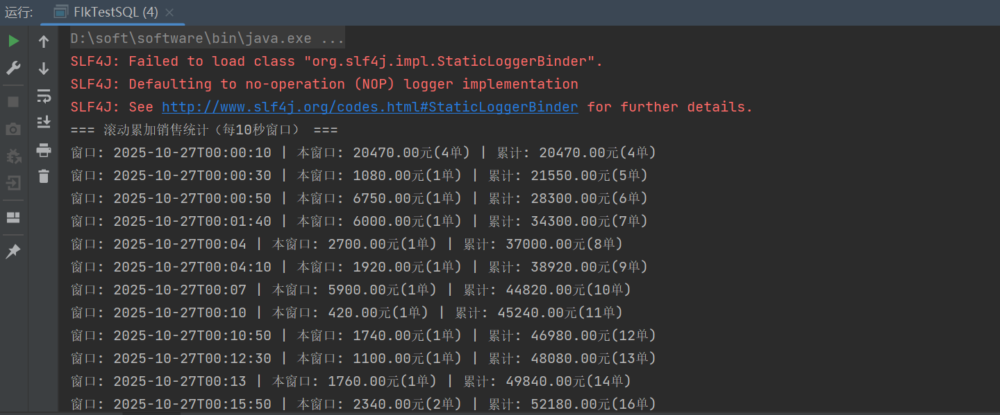

###251027 张艺豪

1.flink cdc数据写入kafka

2.flink sql

package com.stream.realtime.lululemon;

import com.alibaba.fastjson2.JSON;
import com.alibaba.fastjson2.JSONObject;

import com.stream.core.EnvironmentSettingUtils;
import com.stream.core.KafkaUtils;

import com.stream.realtime.lululemon.func.MapMergeJsonData;
import com.ververica.cdc.connectors.base.options.StartupOptions;
import com.ververica.cdc.connectors.sqlserver.SqlServerSource;
import com.ververica.cdc.debezium.DebeziumSourceFunction;
import com.ververica.cdc.debezium.JsonDebeziumDeserializationSchema;
import lombok.SneakyThrows;
import org.apache.flink.connector.kafka.sink.KafkaSink;
import org.apache.flink.streaming.api.datastream.DataStreamSource;
import org.apache.flink.streaming.api.datastream.SingleOutputStreamOperator;
import org.apache.flink.streaming.api.environment.StreamExecutionEnvironment;

import java.util.Properties;

public class DbusSyncSqlserverOmsSysData2kafka {

    private static final String sql_to_kf = "realtime_v3_order_info1";
    private static final String sql_to_kafka_toip = "172.24.158.53:9092";

    @SneakyThrows
    public static void main(String[] args) {
        StreamExecutionEnvironment env = StreamExecutionEnvironment.getExecutionEnvironment();
        EnvironmentSettingUtils.defaultParameter(env);

        KafkaUtils.createKafkaTopic(sql_to_kafka_toip,sql_to_kf,3,(short) 1,true);

        Properties debeziumProperties = new Properties();
        debeziumProperties.put("snapshot.mode", "initial");
        debeziumProperties.put("database.history.store.only.monitored.tables.ddl", "true");
        DebeziumSourceFunction<String> sqlServerSource = SqlServerSource.<String>builder()
                .hostname("192.168.200.30")
                .port(1433)
                .username("sa")
                .password("zhangyihao@123")
                .database("realtime_v3")
                .tableList("dbo.oms_order_dtl")
                .startupOptions(StartupOptions.initial())
                .debeziumProperties(debeziumProperties)
                .deserializer(new JsonDebeziumDeserializationSchema())
                .build();

        DataStreamSource<String> dataStreamSource = env.addSource(sqlServerSource, "_transaction_log_source1");
        SingleOutputStreamOperator<JSONObject> convertStr2JsonDs = dataStreamSource.map(JSON::parseObject)
                .uid("convertStr2JsonDs")
                .name("convertStr2JsonDs");

        SingleOutputStreamOperator<JSONObject> processedData = convertStr2JsonDs.map(new MapMergeJsonData());
        processedData.print("map_flit_to_kafka");

        // 构建Kafka Sink并将数据写入Kafka
        KafkaSink<String> kafkaSink = KafkaUtils.buildKafkaSink(sql_to_kafka_toip,sql_to_kf);

        SingleOutputStreamOperator<String> kafkaDataStream = processedData
                .map(json ->json.toJSONString())
                .uid("convertToJsonString")
                .name("convertToJsonString");

        kafkaDataStream.sinkTo(kafkaSink)
                .uid("kafkaSink")
                .name("kafkaSink");

        env.execute("sqlserver-cdc-test");
    }
}

