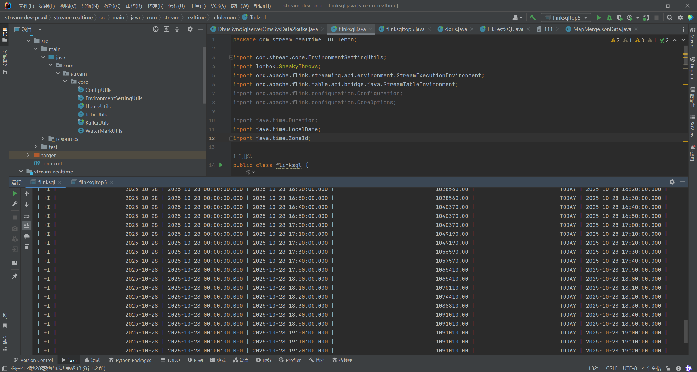

###251028 张艺豪

1.每十秒计算一次累计金额
package com.stream.realtime.lululemon;

import com.stream.core.EnvironmentSettingUtils;
import lombok.SneakyThrows;
import org.apache.flink.streaming.api.environment.StreamExecutionEnvironment;
import org.apache.flink.table.api.bridge.java.StreamTableEnvironment;
import org.apache.flink.configuration.Configuration;
import org.apache.flink.configuration.CoreOptions;

import java.time.Duration;
import java.time.LocalDate;
import java.time.ZoneId;

public class flinksql {
@SneakyThrows
public static void main(String[] args) {
System.setProperty("HADOOP_USER_NAME", "root");
StreamExecutionEnvironment env = StreamExecutionEnvironment.getExecutionEnvironment();
EnvironmentSettingUtils.defaultParameter(env);
StreamTableEnvironment tenv = StreamTableEnvironment.create(env);
tenv.getConfig().getConfiguration().setString("table.local-time-zone", "Asia/Shanghai");
tenv.getConfig().getConfiguration().setString("table.exec.source.idle-timeout", "30 s");
ZoneId sh = ZoneId.of("Asia/Shanghai");
long today0Millis = LocalDate.now(sh)
.atStartOfDay(sh)
.toInstant()
.toEpochMilli();

        String dll_kafka_oms_order_info = String.format("create table if not exists t_kafka_oms_order_info (                    \n" +
                "    id string,                                                                                                 \n" +
                "    order_id string,                                                                                           \n" +
                "    user_id string,                                                                                            \n" +
                "    user_name string,                                                                                          \n" +
                "    phone_number string,                                                                                       \n" +
                "    product_link string,                                                                                       \n" +
                "    product_id string,                                                                                         \n" +
                "    color string,                                                                                              \n" +
                "    size string,                                                                                               \n" +
                "    item_id string,                                                                                            \n" +
                "    material string,                                                                                           \n" +
                "    sale_num string,                                                                                           \n" +
                "    sale_amount string,                                                                                        \n" +
                "    total_amount string,                                                                                       \n" +
                "    product_name string,                                                                                       \n" +
                "    is_online_sales string,                                                                                    \n" +
                "    shipping_address string,                                                                                   \n" +
                "    recommendations_product_ids string,                                                                        \n" +
                "    ds string,                                                                                                 \n" +
                "    ts bigint,                                                                                                 \n" +
                "    ts_ms as case when ts < 100000000000 then to_timestamp_ltz(ts * 1000, 3) else to_timestamp_ltz(ts, 3) end, \n" +
                "    insert_time string,                                                                                        \n" +
                "    table_name string,                                                                                         \n" +
                "    op string,                                                                                                 \n" +
                "    watermark for ts_ms as ts_ms - interval '5' second                                                         \n" +
                ")                                                                                                              \n" +
                "with (                                                                                                         \n" +
                "    'connector' = 'kafka',                                                                                     \n" +
                "    'topic' = 'realtime_v3_order_info1',                                                                       \n" +
                "    'properties.bootstrap.servers'= '172.24.158.53:9092',                                                      \n" +
                "    'properties.group.id' = 'order-analysis1',                                                                 \n" +
                "    'scan.startup.mode' = 'timestamp',                                                                         \n" +
                "    'scan.startup.timestamp-millis' = '%d',                                                                    \n" +
                "    'format' = 'json',                                                                                         \n" +
                "    'json.fail-on-missing-field' = 'false',                                                                    \n" +
                "    'json.ignore-parse-errors' = 'true'                                                                        \n" +
                ")", today0Millis);

        // 1. 执行创建表的SQL
        tenv.executeSql(dll_kafka_oms_order_info);

        // 2. 修正查询SQL
        String compute0ToCurrentDaySaleAmountGMV =
                "select DATE_FORMAT(window_start, 'yyyy-MM-dd') AS order_date,      \n" +
                        "       window_start,                                       \n" +
                        "       window_end,                                         \n" +
                        "       SUM(CAST(total_amount AS DECIMAL(18,2))) AS gmv,    \n" +
                        "       'TODAY' AS type,                                    \n" +
                        "       window_end AS calc_time                             \n" +
                        "from TABLE(                                                \n" +
                        "    CUMULATE(                                              \n" +
                        "        TABLE t_kafka_oms_order_info,                      \n" +
                        "        DESCRIPTOR(ts_ms),                                 \n" +
                        "        INTERVAL '10' minutes,                             \n" +
                        "        INTERVAL '1' DAY                                   \n" +
                        "    )                                                      \n" +
                        ") where ts_ms >= floor(current_timestamp to day)           \n" +
                        "group by window_start, window_end;                    ";

        // 3. 执行查询
        tenv.executeSql(compute0ToCurrentDaySaleAmountGMV).print();
        env.execute("Lululemon Today Cumulative GMV Calculation");
    }
}
2.top5
package com.stream.realtime.lululemon;

import com.stream.core.EnvironmentSettingUtils;
import lombok.SneakyThrows;
import org.apache.flink.streaming.api.environment.StreamExecutionEnvironment;
import org.apache.flink.table.api.bridge.java.StreamTableEnvironment;

import java.time.LocalDate;
import java.time.ZoneId;

public class flinksqltop5 {
@SneakyThrows
public static void main(String[] args) {
System.setProperty("HADOOP_USER_NAME", "root");

        // 1. 创建执行环境
        StreamExecutionEnvironment env = StreamExecutionEnvironment.getExecutionEnvironment();
        EnvironmentSettingUtils.defaultParameter(env);
        StreamTableEnvironment tenv = StreamTableEnvironment.create(env);

        // 2. 配置时区和参数
        tenv.getConfig().getConfiguration().setString("table.local-time-zone", "Asia/Shanghai");
        tenv.getConfig().getConfiguration().setString("table.exec.source.idle-timeout", "30 s");

        ZoneId sh = ZoneId.of("Asia/Shanghai");
        long today0Millis = LocalDate.now(sh)
                .atStartOfDay(sh)
                .toInstant()
                .toEpochMilli();

        // 3. 创建Kafka源表
        String createKafkaTableSQL = String.format(
                "CREATE TABLE t_kafka_oms_order_info (\n" +
                        "    id STRING,\n" +
                        "    order_id STRING,\n" +
                        "    user_id STRING,\n" +
                        "    user_name STRING,\n" +
                        "    phone_number STRING,\n" +
                        "    product_link STRING,\n" +
                        "    product_id STRING,\n" +
                        "    color STRING,\n" +
                        "    size STRING,\n" +
                        "    item_id STRING,\n" +
                        "    material STRING,\n" +
                        "    sale_num STRING,\n" +
                        "    sale_amount STRING,\n" +
                        "    total_amount STRING,\n" +
                        "    product_name STRING,\n" +
                        "    is_online_sales STRING,\n" +
                        "    shipping_address STRING,\n" +
                        "    recommendations_product_ids STRING,\n" +
                        "    ds STRING,\n" +
                        "    ts BIGINT,\n" +
                        "    ts_ms AS CASE \n" +
                        "        WHEN ts < 100000000000 THEN TO_TIMESTAMP_LTZ(ts * 1000, 3) \n" +
                        "        ELSE TO_TIMESTAMP_LTZ(ts, 3) \n" +
                        "    END,\n" +
                        "    insert_time STRING,\n" +
                        "    table_name STRING,\n" +
                        "    op STRING,\n" +
                        "    WATERMARK FOR ts_ms AS ts_ms - INTERVAL '5' SECOND\n" +
                        ") WITH (\n" +
                        "    'connector' = 'kafka',\n" +
                        "    'topic' = 'realtime_v3_order_info1',\n" +
                        "    'properties.bootstrap.servers' = '172.24.158.53:9092',\n" +
                        "    'properties.group.id' = 'order-analysis-top5',\n" +
                        "    'scan.startup.mode' = 'timestamp',\n" +
                        "    'scan.startup.timestamp-millis' = '%d',\n" +
                        "    'format' = 'json',\n" +
                        "    'json.fail-on-missing-field' = 'false',\n" +
                        "    'json.ignore-parse-errors' = 'true'\n" +
                        ")", today0Millis);

        tenv.executeSql(createKafkaTableSQL);
        System.out.println("Kafka表创建成功！");

        // 4. 创建Top5商品查询的临时视图
        String createTop5ViewSQL =
                "CREATE TEMPORARY VIEW product_sales_view AS\n" +
                        "SELECT\n" +
                        "    window_start,\n" +
                        "    window_end,\n" +
                        "    product_id,\n" +
                        "    product_name,\n" +
                        "    SUM(CAST(total_amount AS DECIMAL(18,2))) AS total_sales,\n" +
                        "    SUM(CAST(sale_num AS BIGINT)) AS total_quantity\n" +  // 改为BIGINT
                        "FROM TABLE(\n" +
                        "    CUMULATE(\n" +
                        "        TABLE t_kafka_oms_order_info,\n" +
                        "        DESCRIPTOR(ts_ms),\n" +
                        "        INTERVAL '10' MINUTE,\n" +
                        "        INTERVAL '1' DAY\n" +
                        "    )\n" +
                        ")\n" +
                        "WHERE CAST(ts_ms AS DATE) = CURRENT_DATE\n" +
                        "GROUP BY window_start, window_end, product_id, product_name";

        tenv.executeSql("DROP TEMPORARY VIEW IF EXISTS product_sales_view");
        tenv.executeSql(createTop5ViewSQL);
        System.out.println("临时视图创建成功！");

        // 5. 创建结果表 - 修正字段类型
        String createTop5ResultTableSQL =
                "CREATE TABLE top5_products_result (\n" +
                        "    window_start_time STRING,\n" +
                        "    window_end_time STRING,\n" +
                        "    product_id STRING,\n" +
                        "    product_name STRING,\n" +
                        "    total_sales DECIMAL(38, 2),\n" +  // 改为38,2以匹配SUM结果
                        "    total_quantity BIGINT,\n" +       // 改为BIGINT
                        "    rank_num BIGINT\n" +              // 改为BIGINT以匹配ROW_NUMBER结果
                        ") WITH (\n" +
                        "    'connector' = 'print',\n" +
                        "    'print-identifier' = 'TOP5_PRODUCTS'\n" +
                        ")";

        tenv.executeSql("DROP TABLE IF EXISTS top5_products_result");
        tenv.executeSql(createTop5ResultTableSQL);

        // 6. 插入查询结果到print表 - 添加显式类型转换
        String insertTop5SQL =
                "INSERT INTO top5_products_result\n" +
                        "SELECT \n" +
                        "    window_start_time,\n" +
                        "    window_end_time,\n" +
                        "    product_id,\n" +
                        "    product_name,\n" +
                        "    total_sales,\n" +
                        "    total_quantity,\n" +
                        "    rank_num\n" +
                        "FROM (\n" +
                        "    SELECT\n" +
                        "        DATE_FORMAT(window_start, 'yyyy-MM-dd HH:mm:ss') AS window_start_time,\n" +
                        "        DATE_FORMAT(window_end, 'yyyy-MM-dd HH:mm:ss') AS window_end_time,\n" +
                        "        product_id,\n" +
                        "        product_name,\n" +
                        "        CAST(total_sales AS DECIMAL(38, 2)) AS total_sales,\n" +  // 显式转换
                        "        CAST(total_quantity AS BIGINT) AS total_quantity,\n" +    // 显式转换
                        "        CAST(ROW_NUMBER() OVER (PARTITION BY window_start, window_end ORDER BY total_sales DESC) AS BIGINT) AS rank_num\n" +  // 显式转换
                        "    FROM product_sales_view\n" +
                        "    WHERE product_id IS NOT NULL\n" +
                        "      AND total_sales > 0\n" +
                        ") WHERE rank_num <= 5";

        // 7. 为GMV创建结果表 - 同样修正字段类型
        String createGmvResultTableSQL =
                "CREATE TABLE gmv_result (\n" +
                        "    order_date STRING,\n" +
                        "    window_start TIMESTAMP(3),\n" +
                        "    window_end TIMESTAMP(3),\n" +
                        "    gmv DECIMAL(38, 2),\n" +  // 改为38,2
                        "    type STRING,\n" +
                        "    calc_time TIMESTAMP(3)\n" +
                        ") WITH (\n" +
                        "    'connector' = 'print',\n" +
                        "    'print-identifier' = 'GMV_RESULT'\n" +
                        ")";

        tenv.executeSql("DROP TABLE IF EXISTS gmv_result");
        tenv.executeSql(createGmvResultTableSQL);

        // 8. GMV查询 - 添加显式类型转换
        String insertGmvSQL =
                "INSERT INTO gmv_result\n" +
                        "SELECT \n" +
                        "    DATE_FORMAT(window_start, 'yyyy-MM-dd') AS order_date,\n" +
                        "    window_start,\n" +
                        "    window_end,\n" +
                        "    CAST(SUM(CAST(total_amount AS DECIMAL(18,2))) AS DECIMAL(38, 2)) AS gmv,\n" +  // 显式转换
                        "    'TODAY' AS type,\n" +
                        "    window_end AS calc_time\n" +
                        "FROM TABLE(\n" +
                        "    CUMULATE(\n" +
                        "        TABLE t_kafka_oms_order_info,\n" +
                        "        DESCRIPTOR(ts_ms),\n" +
                        "        INTERVAL '10' MINUTE,\n" +
                        "        INTERVAL '1' DAY\n" +
                        "    )\n" +
                        ") \n" +
                        "WHERE CAST(ts_ms AS DATE) = CURRENT_DATE\n" +
                        "GROUP BY window_start, window_end";

        System.out.println("开始执行流式查询...");
        System.out.println("GMV结果将以 'GMV_RESULT>' 为前缀输出");
        System.out.println("Top5商品结果将以 'TOP5_PRODUCTS>' 为前缀输出");

        // 9. 执行插入操作
        tenv.executeSql(insertGmvSQL);
        tenv.executeSql(insertTop5SQL);

        // 10. 执行任务
        env.execute("Lululemon Real-time GMV and Top5 Products Analysis");
    }
}
