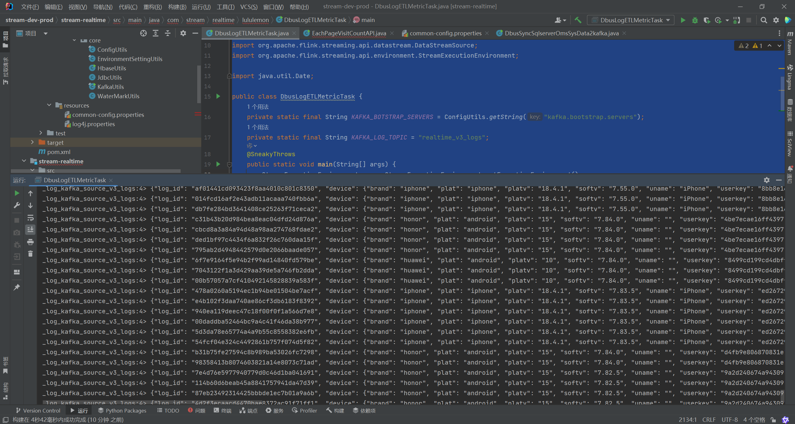

###251031 张艺豪

1.读取日志数据
package com.stream.realtime.lululemon;

import com.stream.core.ConfigUtils;
import com.stream.core.EnvironmentSettingUtils;
import com.stream.core.KafkaUtils;
import com.stream.core.WaterMarkUtils;
import lombok.Data;
import lombok.SneakyThrows;
import org.apache.flink.connector.kafka.source.enumerator.initializer.OffsetsInitializer;
import org.apache.flink.streaming.api.datastream.DataStreamSource;
import org.apache.flink.streaming.api.environment.StreamExecutionEnvironment;

import java.util.Date;

public class DbusLogETLMetricTask {
private static final String KAFKA_BOTSTRAP_SERVERS = ConfigUtils.getString("kafka.bootstrap.servers");
private static final String KAFKA_LOG_TOPIC = "realtime_v3_logs";
@SneakyThrows
public static void main(String[] args) {
StreamExecutionEnvironment env = StreamExecutionEnvironment.getExecutionEnvironment();
EnvironmentSettingUtils.defaultParameter(env);

        DataStreamSource<String> originKafkaLogDs = env.fromSource(
                KafkaUtils.buildKafkaSource(KAFKA_BOTSTRAP_SERVERS, KAFKA_LOG_TOPIC, new Date().toString(), OffsetsInitializer.earliest()),
                WaterMarkUtils.publicAssignWatermarkStrategy("ts", 5L),
                "_log_kafka_source_v3_logs"
        );
        originKafkaLogDs.print("_log_kafka_source_v3_logs");

        env.execute();

    }
}

2.doris报表
